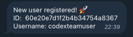
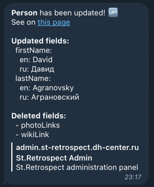

# mongodb-changes-notifier

With this tool you'll be able to be notified of any data changes in MongoDB.
You can select what collections you want to watch, what change event types you interested in and generate notifications with the provided template.

## Features

- Watching for changes in your data
- Notification via Telegram Bot
- Filtering by [Change event type](https://docs.mongodb.com/manual/reference/change-events/)
- Watching for several collections at once
- Template engine with funcs provided by [sprig](https://github.com/Masterminds/sprig)

## Prerequirements

- [MongoDB replica set](https://docs.mongodb.com/manual/tutorial/deploy-replica-set/)
- [Webhook from CodeX notify bot](https://github.com/codex-bot/notify)

## Usage

1. Create `config.yml` file using example file [./config.sample.yml](./config.sample.yml)
2. Run `./mongodb-logger` command. By default, it will use `config.yml` file from current directory, but you can provide your owm path via `-config` flag

## TODO
- [ ] Another notifications channels (Email, Slack, etc)
- [ ] Watching for collections by regexp
- [ ] Watching the entire deployment ([link](https://docs.mongodb.com/manual/changeStreams/#watch-collection-database-deployment))
- [ ] Docker configuration
- [ ] Custom variables providing

## Docker usage
This tool also available as Docker image on DockerHub.

You can use it in the way like it:

```yaml
version: "3.8"

services:
  app:
    image: "codexteamuser/mongodb-changes-notifier"
    volumes:
      - ./config.yml:/config.yml:ro
```

## Example

### Logging users registrations

```yaml
# MongoDB URI for connecting
# See https://docs.mongodb.com/manual/reference/connection-string/
mongodb_uri: "mongodb://127.0.0.1:27017/retrospect?readPreference=primary&replicaSet=rs0"

# List of watches config
# Describe here what collections you want to watch and what send when event fires
watches:
    # List of event types you want to watch.
    # See https://docs.mongodb.com/manual/reference/change-events/
  - event_types:
      - insert
    # List of collection names you want to watch
    collections:
      - users
    # Notify hook from CodeX bot for sending notifications
    # See https://github.com/codex-bot/notify
    notify_hook: "https://notify.bot.codex.so/u/O7BK8PA6"

    # Notification template. Renders via text/template module
    template: |
      New user registered! 🚀
      ID:  {{ .fullDocument._id.Hex }}
      Username: {{ .fullDocument.username }}
```

You will receive the following notification when new user register:



### Logging data updates

```yaml
# MongoDB URI for connecting
# See https://docs.mongodb.com/manual/reference/connection-string/
mongodb_uri: "mongodb://127.0.0.1:27017/retrospect?readPreference=primary&replicaSet=rs0"

# List of watches config
# Describe here what collections you want to watch and what send when event fires
watches:
    # List of event types you want to watch.
    # See https://docs.mongodb.com/manual/reference/change-events/
  - event_types:
      - update
    # List of collection names you want to watch
    collections:
      - persons
    # Notify hook from CodeX bot for sending notifications
    # See https://github.com/codex-bot/notify
    notify_hook: "https://notify.bot.codex.so/u/O7BK8PA6"

    # Notification template. Renders via text/template module
    template: |
      <b>Person</b> has been updated! 🆙
      See on <a href="https://admin.st-retrospect.dh-center.ru/persons/{{ printf "%s%s" "Person:" .documentKey._id.Hex | b64enc }}">this page</a>

      <b>Updated fields:</b>
      {{ .updateDescription.updatedFields | toYaml | indent 2 }}
      <b>Deleted fields:</b>
      {{ .updateDescription.removedFields | toYaml | indent 2 }}
```

You will receive the following notification when someone changes data of the person:

